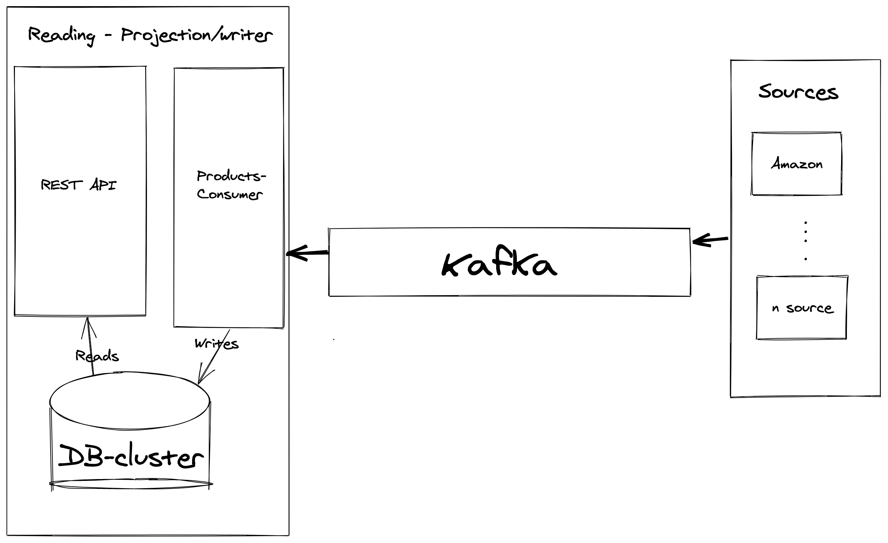

# products-comparison

##### This project is composed of 2 microservices
   * REST API (Reading ) + projection consumer that updates the db in a realtime fashion.
   * Sources scraping and mapping 
   
## REST API (Reading ) + projection consumer ##
   built using reactor reactive stream on jvm  and high performance batch db writing using jdbc template api

## Sources scraping and mapping ##
 is built using reactive kafka that integrate reactive streams with kafka API  
   

## Following the reactive architecture the high level overview is ##   

### what is missing ###
1. Separating the projection consumer to be a separate service using kafka-connect
2. Using elastic search cluster as a primary source of data
3. Using kubernetes  
4. More test coverage 
	   

## Requirement ##
* jave 15 
* maven 
* Docker
 
## Build ## 
 1. run `mvn clean package` to create the jar file
 2. run ` docker-compose up --build`

## Try ## 
 
 1. call  `${localhost/docker-machine-ip}:8080/category ` to list all the available categories
 2. call  `${localhost/docker-machine-ip}:8080/category/{Category_id}/product/{Product_name} ` to list all the available products that have similar name with prices
 eg: call  `http://192.168.99.100/:8080/category/1/product/iphone `
 
 
 
  
   
    
    
        
     
